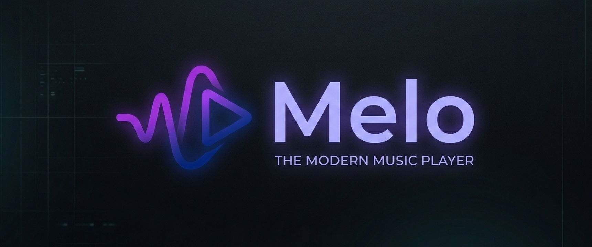

<p align="center">
  
</p>

<h1 align="center">Melo</h1>

<p align="center">
  <strong>A modern, powerful, and cross-platform music player.</strong>
</p>

<p align="center">
  
  
  
</p>

---

## 🎶 About Melo

Melo is a music player designed for speed and versatility. While it currently offers a powerful and intuitive Command-Line Interface (CLI), it is architected with a future-proof mindset to support graphical interfaces across multiple platforms. Melo seamlessly integrates with top-tier music services like Spotify, Last.fm, and MusicBrainz to provide a unified listening experience.

## ✨ Features

- 🚀 **Intuitive CLI**: Full control from your terminal with high-quality TUI components.
- 🔍 **Multi-source Search**: Discover tracks across Spotify, iTunes, and MusicBrainz simultaneously.
- 📻 **Music Discovery**: Integration with Last.fm to find similar artists and suggest new tracks.
- 🎧 **Direct Streaming**: High-quality audio streaming via Piped integration.
- 📦 **Cross-platform Support**: Runs on any system with Java 21+ (**Windows**, **macOS**, **Linux**).

## 🛠️ Tech Stack

- **Language**: [Kotlin](https://kotlinlang.org/) (JVM)
- **Build System**: [Gradle 9.1.0](https://gradle.org/) with Kotlin DSL
- **Architecture**: Clean Architecture principles (Modules: `cli`, `core`, `data`)
- **CLI Framework**: [Clikt](https://ajalt.github.io/clikt/) · [TamboUI](https://tamboui.dev/)
- **Dependency Injection**: [Koin](https://insert-koin.io/)

## 🚀 Getting Started

### Prerequisites
- **Java 21** or higher — [Download Temurin](https://adoptium.net/)

### Installation from release

Download the archive for your platform from the [latest release](https://github.com/Adriianh/Melo/releases/latest) and run the installer:

**Linux / macOS**
```bash
tar -xzf melo-*-linux.tar.gz   # or macos
cd melo-*/
chmod +x install.sh
./install.sh
# Then add ~/.local/bin to your PATH if it isn't already:
# export PATH="$HOME/.local/bin:$PATH"   # add this to ~/.bashrc or ~/.zshrc
```

**Windows** (PowerShell)
```powershell
Expand-Archive melo-*-windows.zip
cd melo-*\
.\install.ps1
# Open a new terminal — melo is now on your PATH
```

After installation, run:
```
melo search
```

### Uninstall

**Linux / macOS**
```bash
cd melo-*/
./uninstall.sh
```

**Windows** (PowerShell)
```powershell
cd melo-*\
.\uninstall.ps1
```

---

### Building from source

1. Clone the repository:
   ```bash
   git clone https://github.com/Adriianh/Melo.git
   cd Melo
   ```
2. Build the fat-JAR:
   ```bash
   ./gradlew :cli:shadowJar
   # Output: cli/build/libs/melo.jar
   ```
3. Run directly:
   ```bash
   java -jar cli/build/libs/melo.jar search
   ```
4. Or build a distributable archive for your current OS:
   ```bash
   ./gradlew :cli:dist
   # Output: cli/build/dist/melo-*-<os>.tar.gz (or .zip on Windows)
   ```

## 📈 Roadmap

- [x] Core structure and Clean Architecture setup.
- [x] API integration with Spotify, Last.fm, and MusicBrainz.
- [x] Automated cross-platform distribution (fat-JAR + shell wrappers).
- [ ] GUI implementation using Compose for Desktop.
- [ ] Local library and playlist management.

## 📄 License

This project is licensed under the MIT License. See the [LICENSE](LICENSE) file for details.

---
<p align="center">Handcrafted with ❤️ by <a href="https://github.com/Adriianh">Adriianh</a></p>