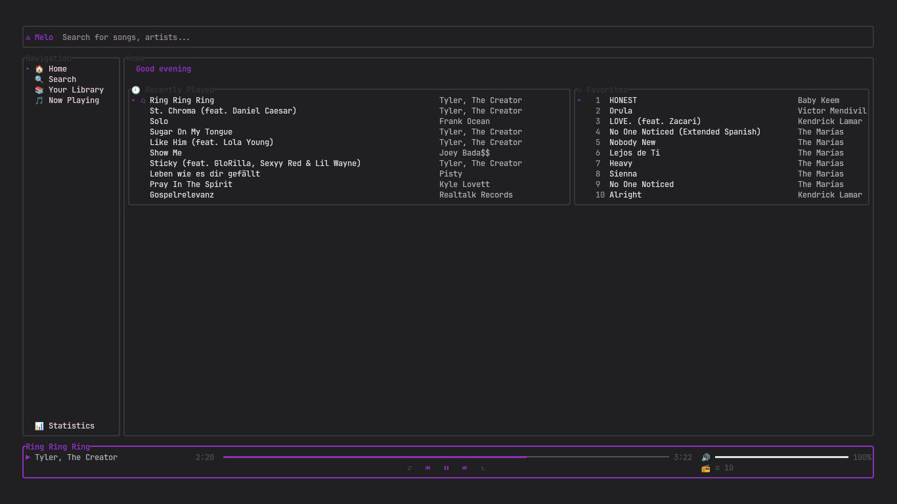
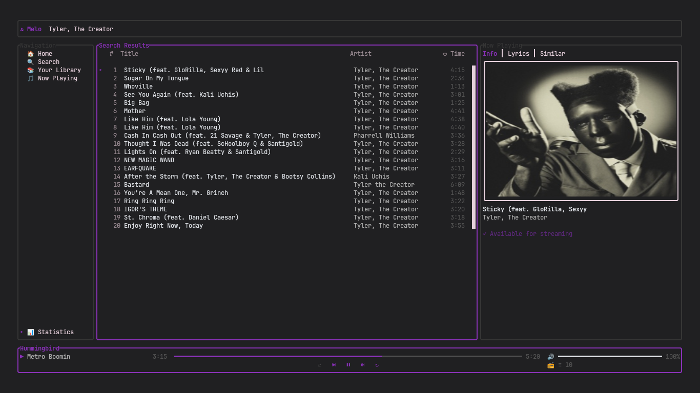
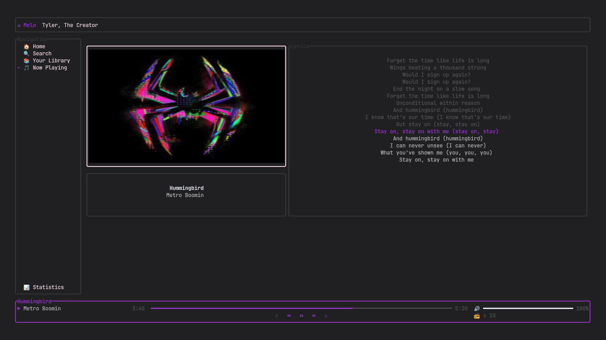
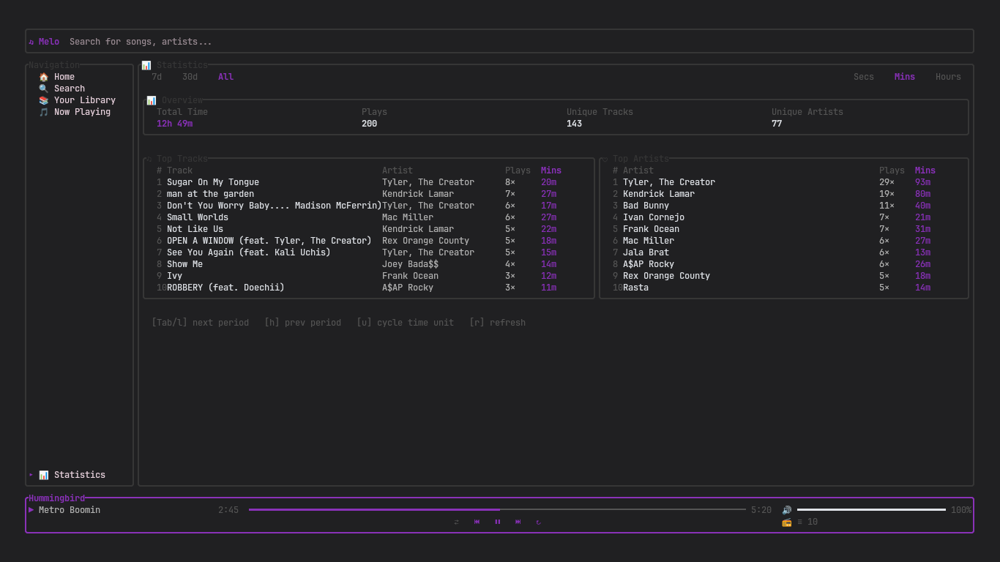

<p align="center">
  
</p>

<h1 align="center">Melo</h1>

<p align="center">
  <strong>Modern, fast, and cross-platform music player</strong>
</p>

<p align="center">
  
  
  
  
  
</p>

---

## 🚀 Quick Start

1. **Download** the latest release for your platform from [GitHub Releases](https://github.com/Adriianh/Melo/releases/latest).
2. **Install** using the provided script for your OS (see below).
3. **Configure** your API keys in the generated `.env` file.
4. **Run** `melo` from your terminal and enjoy!

---

## 🖼️ Demo

<p align="center">
  
  
  
  
</p>
<p align="center">
  <em>Home</em> &nbsp; | &nbsp; <em>Search</em> &nbsp; | &nbsp; <em>Song</em> &nbsp; | &nbsp; <em>Stats</em>
</p>

---

## Features

- **Unified Search**: Find and play music from multiple sources in one place.
- **Rich Terminal UI**: Intuitive, keyboard-driven interface for efficient navigation.
- **Flexible Queue**: Manage your playback queue, shuffle, repeat, and favorites.
- **Continuous Playback**: Automatic radio and recommendations when your queue ends.
- **Artwork & Lyrics**: Inline album art and lyrics support.
- **Direct Streaming**: High-quality playback with minimal latency.
- **Cross-Platform**: Native builds for Windows, macOS, and Linux.

---

## Configuration

After installation, configuration files are created in your user config directory (e.g., `~/.config/melo` or `%APPDATA%\melo`).
Add your API keys and credentials to the `.env` file as needed:

```env
LASTFM_API_KEY=your_lastfm_key
SPOTIFY_CLIENT_ID=your_spotify_id
SPOTIFY_CLIENT_SECRET=your_spotify_secret
```

You can also manage configuration directly from the terminal using the built-in `config` command:

```bash
melo config set <key> <value>      # Set a configuration value
melo config list                  # List all configuration values
melo config auth <provider>       # Authenticate with a provider (e.g., Spotify)
```

For more details, run:

```bash
melo config --help
```

You can also use `--help` with any subcommand for more details, e.g., `melo config set --help`.

---

## Installation

### Prerequisites
- Java 21+ (for building or running the JAR)
- [yt-dlp](https://github.com/yt-dlp/yt-dlp) and [ffmpeg](https://ffmpeg.org/) (for audio streaming)

### From Release

Download the latest release for your platform from [GitHub Releases](https://github.com/Adriianh/Melo/releases/latest).

**Linux / macOS**
```bash
tar -xzf melo-*-linux.tar.gz   # or macos
cd melo-*/
./install.sh
```

**Windows** (PowerShell)
```powershell
Expand-Archive melo-*-windows.zip
cd melo-*\
.\install.ps1
```

After installation, run `melo` from your terminal.

### Uninstall

**Linux / macOS**
```bash
cd melo-*/
./uninstall.sh
```

**Windows** (PowerShell)
```powershell
cd melo-*\
.\uninstall.ps1
```

---

## Building from Source

1. Clone the repository:
   ```bash
   git clone https://github.com/Adriianh/Melo.git
   cd Melo
   ```
2. Build the native binary for your platform:
   ```bash
   ./gradlew :cli:nativeCompile
   # Output: cli/build/native/nativeCompile/melo (or melo.exe on Windows)
   ```
3. Or build the distributable archive:
   ```bash
   ./gradlew :cli:dist
   # Output: cli/build/dist/
   ```

---

## Contributing

We welcome contributions! To collaborate effectively:

- Fork the repository and create a feature or fix branch (e.g., `feat/feature-name` or `fix/bug-description`).
- Follow the [Conventional Commits](https://www.conventionalcommits.org/) style for commit messages.
- Ensure your code is clean, documented, and tested.
- Run all tests and verify builds before submitting a pull request.
- Open a pull request with a clear description of your changes and testing steps.
- Review the [GitHub Guidelines](.github/copilot-instructions.md) for more details on workflow and code style.
- If you find a bug or have a feature request, please open an issue with clear steps to reproduce or describe the enhancement.

---

## License

Melo is licensed under the GNU General Public License v3.0 (GPLv3). See [LICENSE](LICENSE) for
details.
