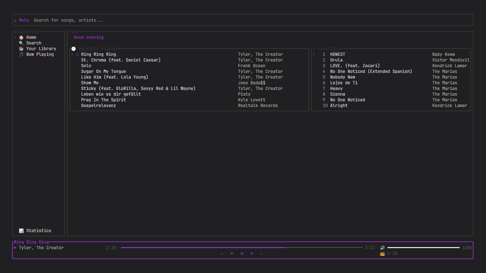
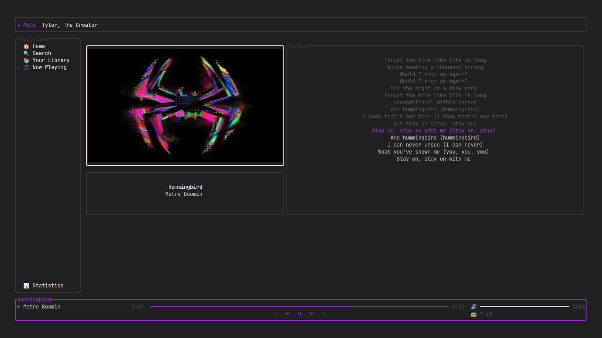
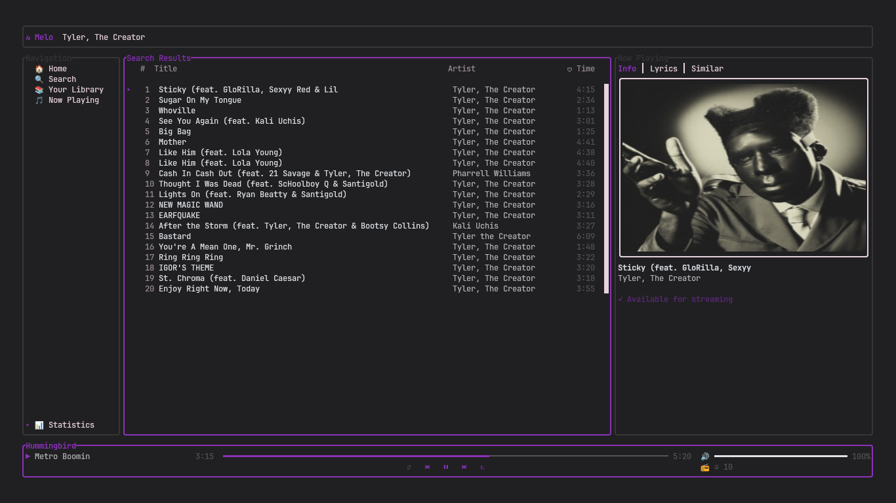
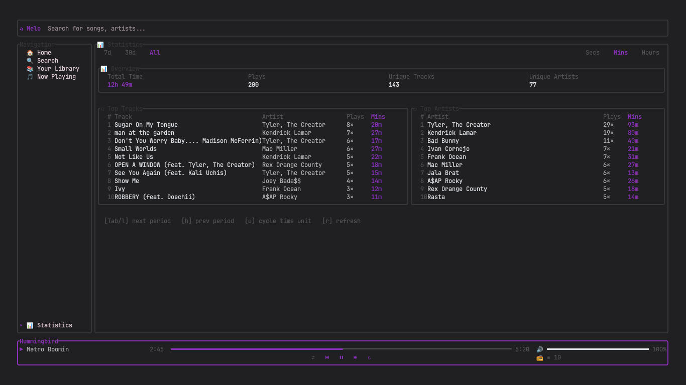

<h1 align="center">Melo</h1>

<p align="center">
  <strong>Modern, fast, and beautiful music player for Android, Desktop, and Terminal</strong><br>
  <em>Built with Kotlin Multiplatform & Compose Multiplatform</em>
</p>

<p align="center">
  <a href="https://github.com/Adriianh/Melo/releases"></a>
  
  
  
  
</p>

<p align="center">
  <a href="#-downloads">Downloads</a> •
  <a href="#-highlights">Highlights</a> •
  <a href="#-gui-experience">GUI Experience</a> •
  <a href="#-terminal-tui--cli">Terminal TUI</a> •
  <a href="#-tech-stack">Tech Stack</a> •
  <a href="#-roadmap">Roadmap</a>
</p>

---

## ⚡ Overview

**Melo** is a cross-platform music streaming and local audio player that combines visual elegance with high-performance audio engineering. It gives you the best of both worlds:

- 🎨 **Melo GUI (Compose Multiplatform)**: A native, fluid graphical interface for **Android** and **Desktop (Linux, Windows, macOS)** featuring dynamic ambient theming, synchronized LRC lyrics with live translation, and offline downloads.
- 💻 **Melo TUI & CLI**: A fast, keyboard-centric terminal interface and headless daemon for lightweight background listening and shell integration.

---

## 📦 Downloads

Pre-built binaries and packages for **v2.0.0** are available on the [GitHub Releases](https://github.com/Adriianh/Melo/releases/latest) page:

| Platform | Format / Package | Description |
|---|---|---|
| **Android** | `composeApp-release.apk` | Signed APK for Android 7.0+ (ARM64 & x86_64) |
| **Linux** | `.AppImage` • `.deb` • `.tar.gz` | Standalone AppImage (portable) or Debian/Ubuntu package |
| **Windows** | `Melo-Setup.exe` • `.msi` | Modern installer (Inno Setup) or enterprise MSI |
| **macOS** | `.dmg` | Native Apple disk image installer |
| **Terminal (CLI/TUI)** | Native binary | Fast GraalVM native binary for Linux, macOS, and Windows |

---

## ✨ Highlights

### 🎵 Resilient Multi-Client Audio Engine
- Streams music from YouTube Music using InnerTube with automatic client fallback (Android, Web, iOS).
- Parallel age-gate resolution with embedded `yt-dlp` + QuickJS runtime for restricted and geo-blocked tracks.
- Stream URL caching and prefetching to eliminate latency between tracks.

### 📜 Synchronized Lyrics with Live Translation
- Real-time LRC lyric tracking with smooth automatic centering and verse jumping.
- On-the-fly lyrics translation powered by Google Translate.

### 🎨 Dynamic Palette & Ambient Canvas
- Real-time accent extraction from album artwork that smoothly shifts UI highlights.
- Hardware-accelerated GPU ambient background (`graphicsLayer`) that pulses gently without causing CPU recompositions.
- Dark-first design system combining **Material 3** for navigation with **Glassmorphism** in the floating player and Now Playing screen.

### 📱 Deep Native Integration
- **Android**: Jetpack Media3 `ExoPlayer`, background `MediaSessionService`, lock screen playback controls, and notification center integration.
- **Desktop**: Native Media Keys (`MPRIS` on Linux, `SMTC` on Windows, macOS system media keys via JMTC).

### 💾 Offline Mode & Local Media
- Integrated download manager with persistent metadata and automated cleanup.
- Local audio library scanner that parses tags and embedded covers from local files (MP3, FLAC, M4A, etc.).

---

## 🖥️ GUI Experience

Melo's graphical client is built from the ground up using **Compose Multiplatform**:

- **Home Feed**: Instant frame-1 load from offline cache with algorithmic sections (Charts, Trending, Playlists, Albums, Artists, and Speed Dial).
- **Now Playing**: Full-screen and docked modes with album art, interactive queue, lyric view, and audio controls.
- **Search**: Instant suggestions, search history, and unified queries for tracks, artists, albums, and playlists.
- **Library**: Custom playlists (create, rename, reorder, delete), favorites ("Me Gusta"), and play history.

---

## 💻 Terminal TUI & CLI

For minimalists and keyboard-driven workflows, Melo retains its full terminal experience:

```bash
# Launch the interactive terminal UI
melo

# Headless daemon playback
melo daemon start
melo play "Never Gonna Give You Up"
melo pause
melo resume
melo next

# Queue & library management
melo queue list
melo queue add "Bohemian Rhapsody"
melo local scan
```

### TUI Previews

<p align="center">
  
  
</p>
<p align="center">
  
  
</p>

---

## 🛠️ Tech Stack

- **UI Framework**: [Compose Multiplatform](https://www.jetbrains.com/lp/compose-multiplatform/) (Android & Desktop)
- **Core Engine**: [Kotlin Multiplatform (KMP)](https://kotlinlang.org/docs/multiplatform.html)
- **Dependency Injection**: [Koin](https://insert-koin.io/)
- **Networking**: [Ktor Client 3.x](https://ktor.io/) & Kotlinx Serialization
- **Image Pipeline**: [Coil 3](https://coil-kt.github.io/coil/) (memory & disk caching, hardware crossfade)
- **Audio Players**:
  - Android: [AndroidX Media3 ExoPlayer](https://developer.android.com/media/media3)
  - Desktop: Native / Java Sound with [JMTC](https://github.com/dorkbox/SystemTray)
- **Terminal UI**: [Mordant](https://github.com/ajalt/mordant) & [Clikt](https://github.com/ajalt/clikt)

---

## 🏗️ Building from Source

### Prerequisites
- **JDK 21+** (e.g., Eclipse Temurin 21)
- Android SDK (for building the Android APK)

```bash
# Clone the repository
git clone https://github.com/Adriianh/Melo.git
cd Melo

# Run the Desktop client
./gradlew :composeApp:run

# Build the Android release APK
./gradlew :composeApp:assembleRelease

# Package Desktop distribution for your current OS
./gradlew :composeApp:packageReleaseDistributionForCurrentOS

# Build the Terminal native binary
./gradlew :tui:nativeCompile
```

---

## 🗺️ Roadmap

- [x] **v2.0.0 — Compose Multiplatform Client** (Android, Linux, Windows, macOS)
- [x] **v2.0.0 — Synchronized LRC Lyrics & Live Translation**
- [x] **v2.0.0 — Offline Downloads & Local Media Scanner**
- [ ] Last.fm & ListenBrainz scrobbling integration
- [ ] Discord Rich Presence (RPC)
- [ ] Parametric DSP Equalizer
- [ ] Listen Together (Synchronized room playback)
- [ ] Cloud synchronization of playlists and history

---

## 🤝 Contributing

Contributions are welcome! Please follow the [Conventional Commits](https://www.conventionalcommits.org/) style and ensure your code is tested:

```bash
# Run all unit tests
./gradlew test :composeApp:jvmTest
```

---

## 📄 License

Melo is licensed under the **GNU General Public License v3.0 (GPLv3)**. See [LICENSE](LICENSE) for details.
